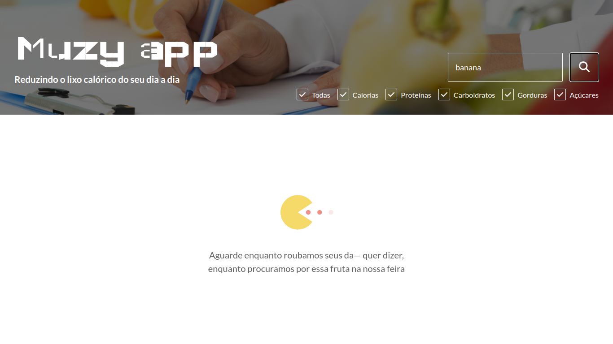
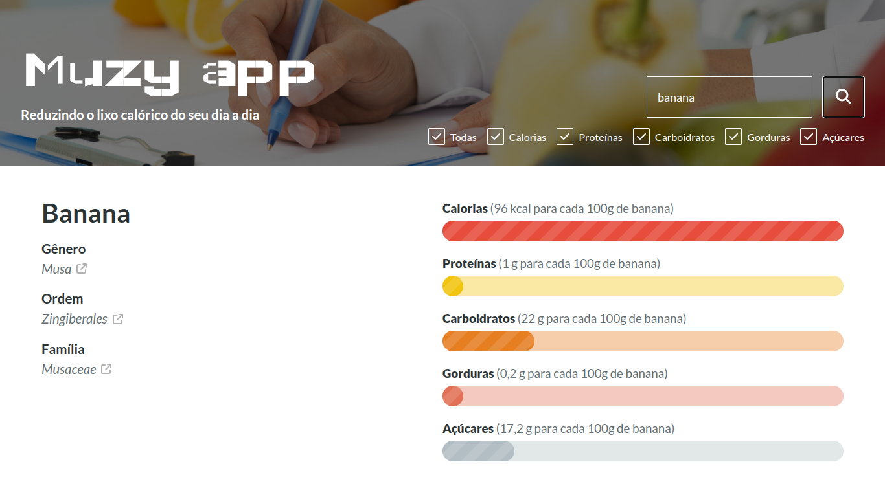
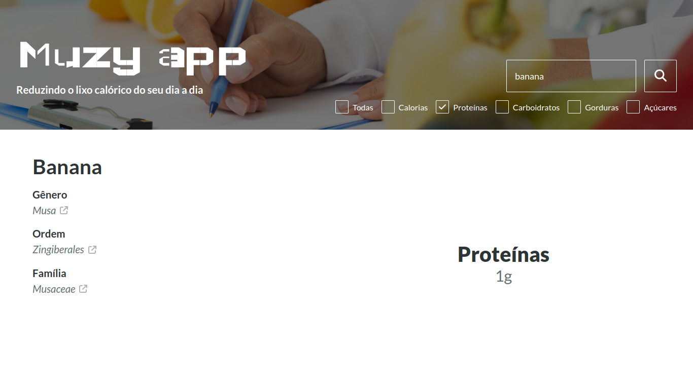
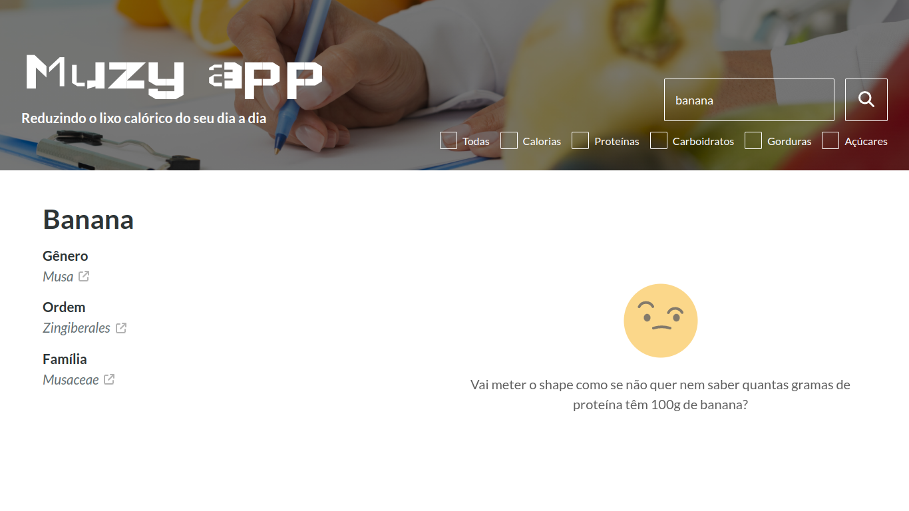

# muzy-app

## Sumário

- [muzy-app](#muzy-app)
  - [Sumário](#sumário)
  - [Motivação](#motivação)
  - [Pilha de tecnologia](#pilha-de-tecnologia)
  - [Galeria](#galeria)
  - [Como rodar](#como-rodar)
    - [Pré-requisitos](#pré-requisitos)
    - [Passo a passo](#passo-a-passo)

## Motivação

Este app consiste em uma tabela nutricional de frutas on-line. Ele utiliza a API [Fruityvice](https://www.fruityvice.com/) para consultar os valores de calorias, proteínas, carboidratos, gorduras e açúcares para cem gramas de uma fruta cadastrada em sua base de dados; além de trazer informações como gênero, ordem e família. Além disso, o app compara os valores de uma fruta filtrados pelo usuário. As frutas cadastradas estão disponíveis [neste endpoint](https://fruityvice.com/api/fruit/all). Infelizmente, devido a uma imprecaução com o mecanismo [_Cross-Origin Resource Sharing_ (CORS)](https://developer.mozilla.org/pt-BR/docs/Web/HTTP/CORS) por parte dos desenvolvedores da API Fruityvice, o professor precisou desenvolver um _wrapper_ para tal API, o qual já não está mais disponível.

Vale destacar que, na tentativa de satisfazer a Lei &numero; 13.146/2015, foi utilizado o atributo [`tabIndex`](https://developer.mozilla.org/pt-BR/docs/Web/HTML/Global_attributes/tabindex) para evitar _keyboard traps_ e propiciar a navegação acessível a usuários com cegueira ou baixa visão.

Este foi o segundo repositório de código apresentado no [Curso Superior de TSI do IFMS](https://www.ifms.edu.br/campi/campus-aquidauana/cursos/graduacao/sistemas-para-internet/sistemas-para-internet) como requisito para obtenção da nota parcial das atividades da unidade curricular Construção de Páginas Web III.

## Pilha de tecnologia

As seguintes tecnologias foram utilizadas para desenvolver este app:

| Papel | Tecnologia |
|-|-|
| Ambiente de execução | [Node](https://nodejs.org/en/) |
| Linguagem de programação | [TypeScript](https://www.typescriptlang.org/) |
| Ambiente de desenvolvimento | [Vite](https://vitejs.dev/) |
| Biblioteca de interface de usuário | [React](https://pt-br.reactjs.org/) |
| Framework de teste | [Jest](https://jestjs.io/pt-BR/) |
| Base de dados | [Fruityvice](https://www.fruityvice.com/) |

Os créditos pelas mídias utilizadas estão disponíveis [aqui](./src/assets/README.md).

## Galeria







## Como rodar

### Pré-requisitos

- [Node](https://nodejs.org/en/download/);
- [Yarn](https://yarnpkg.com/) (opcional).

### Passo a passo

1. Clone o repositório de código em sua máquina;
   
2. Abra um shell de comando de sua preferência (prompt de comando, PowerShell, terminal _etc_.);

3. Instale as dependências do projeto através do seguinte comando:

```console
$ npm install
```

Caso esteja utilizando o gerenciador de pacotes Yarn, execute o seguinte comando como alternativa:

```console
$ yarn
```

4. Finalmente, execute o seguinte comando para iniciar o app:

Para npm:

```console
$ npm run dev
```

Para Yarn:

```console
$ yarn dev
```